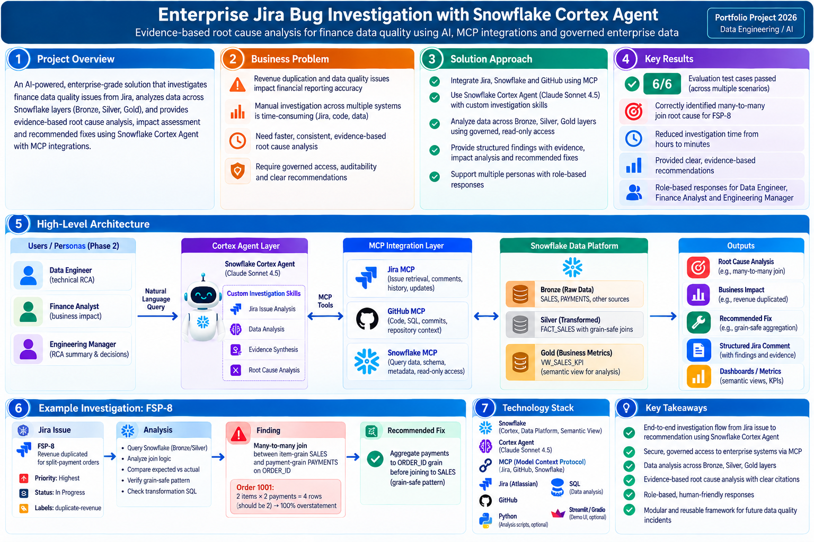
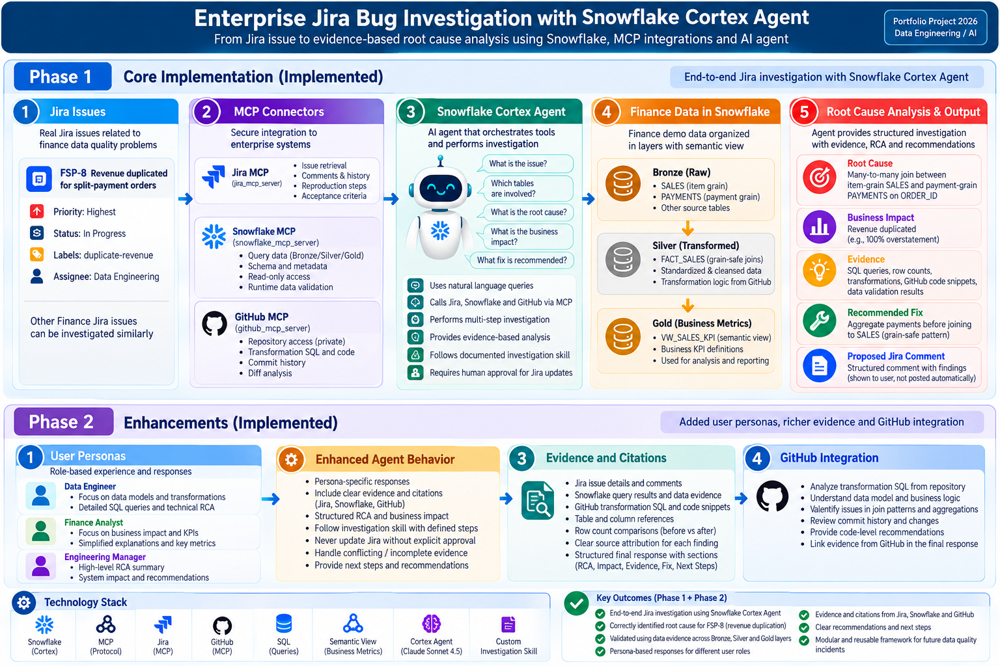
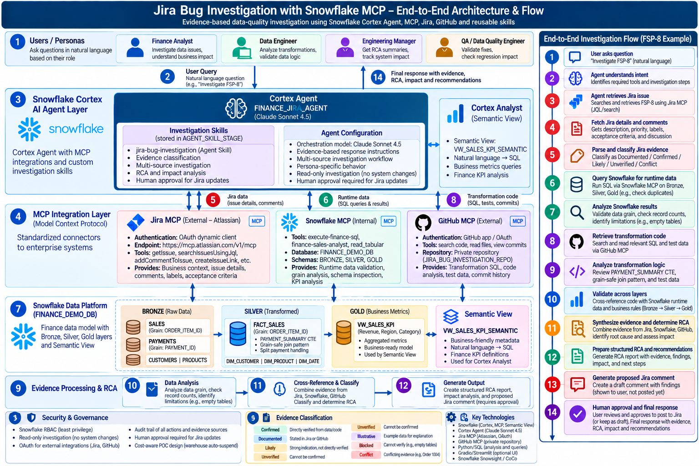
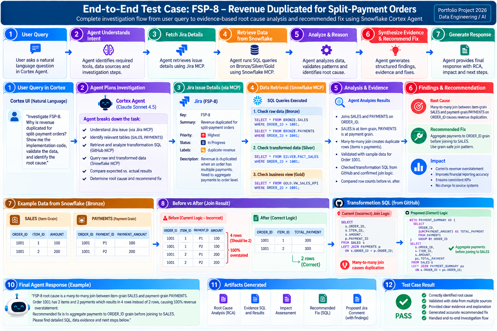

# Jira Bug Investigation with Snowflake MCP

> **Evidence-driven enterprise data-quality investigation using Snowflake Cortex Agent, MCP, Jira, GitHub, reusable investigation skills, and governed human approval.**



[](#)
[](#)
[](#)
[](#)
[](#)

## 1. Project Overview

This project is a **Snowflake-native proof of concept for investigating enterprise data-quality and analytics issues with an AI Agent**.

The representative scenario is:

> **FSP-8 — Revenue is duplicated for split-payment orders**

The project connects three evidence domains:

```text
Jira
  │
  │ Business issue / expected behavior
  ▼
Cortex Agent
  │
  ├──────────────► Snowflake
  │                 Runtime data / SQL / semantic analytics
  │
  └──────────────► GitHub
                    Transformation code / tests / implementation evidence
```

The Agent then follows a governed investigation workflow:

```text
Retrieve
   ↓
Validate
   ↓
Analyze
   ↓
Cross-reference
   ↓
Classify evidence
   ↓
Determine RCA
   ↓
Assess business impact
   ↓
Recommend regression tests
   ↓
Prepare governed next action
```

The central design principle is:

> **The Agent should never claim more than the available evidence can support.**

### Reference / inspiration

The project was inspired by the `deept-agl/Jira_Bug_Analysis_MCP_to_Snowflake` approach. This repository extends the core idea into an evidence-driven investigation workflow using its own Snowflake environment, Jira MCP connection, GitHub MCP integration, Cortex Agent, reusable skill, governance controls, personas, and evaluation scenarios.

For the complete engineering journey, see [`docs/01_PROJECT_OVERVIEW_AND_ENGINEERING_JOURNEY.md`](docs/01_PROJECT_OVERVIEW_AND_ENGINEERING_JOURNEY.md).

---

## 2. What Was Built

### Core platform

```text
Snowflake
├── FINANCE_DEMO_DB
│   ├── BRONZE
│   ├── SILVER
│   └── GOLD
│
├── Semantic View
├── Snowflake MCP
├── Cortex Agent
└── RBAC
```

### Connected enterprise systems

```text
                 ┌───────────────┐
                 │ Cortex Agent  │
                 └───────┬───────┘
                         │
          ┌──────────────┼──────────────┐
          ▼              ▼              ▼
       Jira MCP    Snowflake MCP    GitHub MCP
          │              │              │
          ▼              ▼              ▼
     Business        Runtime /       Implementation
      context          data            evidence
```

The completed POC includes:

- **Snowflake Cortex Agent**
- **Snowflake Cortex Analyst / Semantic View**
- **Atlassian Jira MCP**
- **Snowflake Finance Analytics MCP**
- **GitHub MCP**
- **GitHub App with repository-scoped access**
- **Snowflake Git integration**
- **Reusable investigation skill**
- **CoWork-based skill development**
- **Data Engineer, Finance Analyst, and Engineering Manager personas**
- **RBAC**
- **Read-only investigation controls**
- **Human approval before Jira writes**
- **Lightweight evaluation framework**

---

## 🛠️ Tools & Technologies

| Category | Technologies |
|---|---|
| **Cloud / Data Platform** | Snowflake, Snowflake Cortex |
| **AI / Agent** | Cortex Agent, CoCo, CoWork, Investigation Skills |
| **MCP** | Snowflake MCP, Atlassian Jira MCP, GitHub MCP |
| **Data Engineering** | SQL, Bronze/Silver/Gold, Semantic Views |
| **Source Control** | GitHub, Snowflake Git, GitHub App |
| **Integrations** | Jira Cloud, GitHub |
| **Security & Governance** | Snowflake RBAC, OAuth, Read-only Investigation, Human Approval |
| **Evaluation** | Agent Evaluation Scenarios, Regression Testing, Expected Results |

## 3. Phase 1 → Phase 2



### Phase 1 — Core investigation platform

The foundation established the end-to-end technical path:

```text
Snowflake environment
        ↓
Bronze → Silver → Gold
        ↓
Semantic View
        ↓
Snowflake MCP
        ↓
Jira MCP
        ↓
Cortex Agent
        ↓
RBAC
        ↓
Initial investigation workflow
```

### Phase 2 — Investigation intelligence and evidence

The second phase extended the core platform with:

- **Personas**
- **Evidence classification**
- **Conflict detection**
- **Stronger runtime-vs-implementation boundaries**
- **Reusable investigation skill**
- **GitHub App / GitHub MCP**
- **Snowflake Git integration**
- **FSP-8 end-to-end investigation**
- **Regression-test guidance**
- **Lightweight evaluation**

See the engineering journey for the detailed progression.

---

## 4. Architecture



The implemented architecture is centered on a Cortex Agent with three evidence paths:

```text
Users / Personas
       ↓
Cortex Agent
       ↓
Investigation Skill
       ↓
┌──────────────┬──────────────┬──────────────┐
│              │              │
Jira MCP   Snowflake MCP   GitHub MCP
│              │              │
▼              ▼              ▼
Business      Runtime      Implementation
Evidence      Evidence       Evidence
│              │              │
└──────────────┴──────────────┘
               ↓
      Evidence Reconciliation
               ↓
          RCA + Impact
               ↓
       Regression Guidance
               ↓
        Human Approval
```

The deeper technical architecture, Snowflake objects, MCP configuration, GitHub App, RBAC, and Agent configuration are documented in:

**[`docs/02_TECHNICAL_ARCHITECTURE_AND_IMPLEMENTATION.md`](docs/02_TECHNICAL_ARCHITECTURE_AND_IMPLEMENTATION.md)**

---

## 5. FSP-8: Representative Investigation

### Business problem

Finance users reported that revenue can be overstated for orders completed using multiple successful payment methods.

The relevant relationship is:

```text
SALES
ORDER_ITEM_ID grain
       │
       │ ORDER_ID
       ▼
PAYMENTS
PAYMENT_ID grain
```

If raw payment rows are joined directly to item-grain sales:

```text
2 sales items × 3 successful payments
= 6 joined rows
```

Sales revenue can therefore be repeated across the joined rows.

### Grain-safe implementation pattern

The implementation inspected in GitHub uses:

```text
PAYMENTS
   ↓
filter successful payments
   ↓
GROUP BY ORDER_ID
   ↓
one payment-summary row per order
   ↓
JOIN TO SALES
   ↓
FACT_SALES remains at ORDER_ITEM_ID grain
```

This is the key technical pattern used to prevent payment-side row multiplication.

### End-to-end case study



The complete investigation is documented in:

**[`docs/04_FSP8_END_TO_END_INVESTIGATION.md`](docs/04_FSP8_END_TO_END_INVESTIGATION.md)**

---

## 6. Evidence Model

A central part of the project is preventing the Agent from treating every source as equally authoritative.

| Source | Primary role |
|---|---|
| **Jira** | Reported business issue and documented expectations |
| **Snowflake** | Current runtime/data evidence |
| **GitHub** | Transformation and implementation evidence |

The Agent distinguishes:

- **Confirmed**
- **Documented**
- **Likely**
- **Unverified**
- **Illustrative**
- **Blocked**
- **Conflict**

For example:

> Jira can document that a bug was reported, but that does not independently prove that the current Snowflake runtime reproduces it.

Similarly:

> GitHub can contain a transformation designed to fix a bug, but that does not independently prove that the deployed runtime is executing that transformation successfully.

This evidence boundary is one of the main engineering principles of the project.

See [`docs/03_AGENT_COCOWORK_AND_INVESTIGATION_SKILL.md`](docs/03_AGENT_COCOWORK_AND_INVESTIGATION_SKILL.md) for the detailed investigation-skill design.

---

## 7. Current Runtime Limitation

At the time of the completed FSP-8 investigation:

```text
BRONZE.SALES          = 0 rows
BRONZE.PAYMENTS       = 8 rows
SILVER.FACT_SALES     = 0 rows
GOLD.VW_SALES_KPI     = 0 rows
```

Therefore, the current Snowflake environment **cannot independently reproduce FSP-8 end-to-end using populated sales/fact/Gold runtime data**.

The Agent is explicitly instructed not to:

- Invent missing sales rows
- Simulate runtime results and call them observed
- Treat GitHub test data as current Snowflake data
- Claim runtime fix validation
- Invent current financial impact

This limitation is intentionally preserved in the final investigation rather than hidden.

---

## 8. Key Snowflake Objects

| Object | Purpose |
|---|---|
| `FINANCE_DEMO_DB.GOLD.FINANCE_SALES_SEMANTIC_VIEW` | Business semantic context |
| `FINANCE_DEMO_DB.GOLD.FINANCE_ANALYTICS_MCP_SERVER` | Snowflake MCP |
| `FINANCE_DEMO_DB.GOLD.ATLASSIAN_JIRA_MCP_SERVER` | Jira / Atlassian MCP |
| `FINANCE_DEMO_DB.GOLD.FINANCE_JIRA_AGENT` | Cortex investigation Agent |
| `FINANCE_DEMO_DB.GOLD.GITHUB_JIRA_POC_SECRET` | Git credentials / integration |
| `FINANCE_DEMO_DB.GOLD.GITHUB_JIRA_POC_API` | GitHub API integration |
| `FINANCE_DEMO_DB.GOLD.JIRA_BUG_INVESTIGATION_REPO` | Snowflake Git repository |
| `FINANCE_DEMO_DB.GOLD.VW_SALES_KPI` | Gold business KPI view |
| `FINANCE_DEMO_DB.SILVER.FACT_SALES` | Item-grain fact layer |

### Snowflake data layers

```text
FINANCE_DEMO_DB
│
├── BRONZE
│   ├── SALES
│   ├── PAYMENTS
│   ├── CUSTOMERS
│   └── PRODUCTS
│
├── SILVER
│   ├── FACT_SALES
│   ├── DIM_CUSTOMER
│   ├── DIM_PRODUCT
│   └── DIM_DATE
│
└── GOLD
    ├── VW_SALES_KPI
    └── FINANCE_SALES_SEMANTIC_VIEW
```

---

## 9. Investigation Skill

The reusable skill is:

```text
skills/
└── jira-bug-investigation/
    └── SKILL.md
```

It encodes investigation behavior rather than relying only on a natural-language Agent prompt.

Key responsibilities include:

- Evidence integrity
- Jira retrieval
- Snowflake investigation
- Data availability checks
- Grain validation
- Join validation
- Transformation analysis
- Schema vs runtime distinction
- RCA classification
- Business-impact classification
- Conflict detection
- Regression-test guidance
- Evidence/citation handling
- Jira write approval
- Structured final responses

### CoWork → Cortex Agent development

```text
Investigation requirements
        ↓
CoWork skill design
        ↓
jira-bug-investigation/SKILL.md
        ↓
Agent-specific skill configuration
        ↓
Agent testing
        ↓
Behavior refinement
        ↓
Version 4
        ↓
Evaluation
```

Detailed Agent/CoWork development is documented in:

**[`docs/03_AGENT_COCOWORK_AND_INVESTIGATION_SKILL.md`](docs/03_AGENT_COCOWORK_AND_INVESTIGATION_SKILL.md)**

---

## 10. Personas

The Agent supports different presentation perspectives while preserving the same underlying evidence and classifications.

| Persona | Primary focus |
|---|---|
| **Data Engineer** | Grain, SQL, joins, transformations, reconciliation, regression tests |
| **Finance Analyst** | Revenue, orders, KPIs, reconciliation, business impact |
| **Engineering Manager** | Severity, risk, RCA status, remediation, validation, dependencies |

> **Persona changes presentation and emphasis, not the underlying evidence or RCA classification.**

---

## 11. Governance and Safety

### Read-only investigation

Investigation instructions prohibit data-changing statements such as:

```text
INSERT
UPDATE
DELETE
MERGE
CREATE
ALTER
DROP
TRUNCATE
```

The intended investigation path is:

```text
SELECT
SHOW
DESCRIBE
```

### Jira write approval

The Agent does **not** automatically modify Jira.

Before a Jira write:

1. Show the exact proposed comment.
2. State that it has not been posted.
3. Ask for explicit approval.
4. Perform the write only after approval.

Required approval language:

```text
This comment has NOT been posted to Jira.

Would you like me to post this comment to Jira?
```

### RBAC

The investigation role is:

```text
FINANCE_AGENT_ROLE
```

Permissions are scoped to the investigation environment, including appropriate warehouse, database, schema, data, MCP, Semantic View, and Agent access.

---

## 12. GitHub Integration

The project repository is:

```text
rnemani-ai/jira-bug-investigation-snowflake-mcp
```

The repository was kept private.

A dedicated GitHub App, **Snowflake Jira Bug Investigation**, was installed only on the POC repository with read-oriented repository permissions.

GitHub MCP provides implementation evidence such as:

- Transformation SQL
- Repository structure
- Test-data definitions
- Agent configuration
- Commit history
- Implementation context

Snowflake Git integration provides a complementary source-control/workspace workflow.

---

## 13. Evaluation

The project defines ten evaluation scenarios, with six representative scenarios executed for the completed POC:

| Test | Scenario | Result |
|---|---|---|
| EVAL-001 | Jira issue retrieval | **PASS** |
| EVAL-003 | GitHub transformation lookup | **PASS** |
| EVAL-004 | Full multi-source investigation | **PASS** |
| EVAL-005 | Conflicting evidence | **PASS** |
| EVAL-006 | Empty-data handling | **PASS** |
| EVAL-007 | Data Engineer persona | **PASS** |

### Result

# **6 / 6 executed evaluations passed**

The remaining evaluation scenarios were retained as optional future coverage.

Evaluation artifacts:

```text
evaluations/
├── README.md
├── test_cases.yaml
└── expected_results.md
```

See [`docs/05_EVALUATION_GOVERNANCE_AND_ENGINEERING_ARTIFACTS.md`](docs/05_EVALUATION_GOVERNANCE_AND_ENGINEERING_ARTIFACTS.md) for the detailed evaluation and governance discussion.

---

## 14. Cost-Aware POC Design

Because this project was developed in a Snowflake trial environment, the POC intentionally favored:

- Small test datasets
- Targeted queries
- Read-only investigation
- Lightweight evaluation
- Controlled warehouse usage
- Warehouse auto-suspend
- Avoiding unnecessary full-corpus processing

The project deliberately did not introduce infrastructure that was not required for the investigation problem, such as:

- Vector databases
- Embeddings
- LangChain
- Multi-agent orchestration
- Complex long-term memory
- Large-scale RAG pipelines

---

## 15. Implemented vs. Future

### Implemented

- Snowflake Bronze/Silver/Gold
- Semantic View
- Snowflake MCP
- Jira / Atlassian MCP
- GitHub MCP
- GitHub App
- Snowflake Git integration
- Cortex Agent
- Investigation skill
- CoWork skill-development workflow
- Three personas
- Evidence classification
- RCA and business-impact classification
- Read-only investigation
- Jira human-approval gate
- Evaluation framework
- 6/6 executed evaluations passed

### Not implemented / not claimed

- Production deployment
- Production runtime validation of the FSP-8 fix
- Measured production MTTR reduction
- Demonstrated Confluence evidence workflow
- Vector database / embeddings
- RAG pipeline
- LangChain orchestration
- Multi-agent architecture
- Autonomous Jira modification
- Compliance certification
- Independently measured current financial impact

These boundaries are intentional and are part of the project's evidence-governance design.

---

## 16. Documentation Map

| Document | Purpose |
|---|---|
| [`01_PROJECT_OVERVIEW_AND_ENGINEERING_JOURNEY.md`](docs/01_PROJECT_OVERVIEW_AND_ENGINEERING_JOURNEY.md) | Why the project was built and how it evolved |
| [`02_TECHNICAL_ARCHITECTURE_AND_IMPLEMENTATION.md`](docs/02_TECHNICAL_ARCHITECTURE_AND_IMPLEMENTATION.md) | Detailed Snowflake, MCP, Agent, GitHub and RBAC implementation |
| [`03_AGENT_COCOWORK_AND_INVESTIGATION_SKILL.md`](docs/03_AGENT_COCOWORK_AND_INVESTIGATION_SKILL.md) | CoWork, skill architecture, evidence rules and Agent evolution |
| [`04_FSP8_END_TO_END_INVESTIGATION.md`](docs/04_FSP8_END_TO_END_INVESTIGATION.md) | Complete FSP-8 investigation and technical RCA |
| [`05_EVALUATION_GOVERNANCE_AND_ENGINEERING_ARTIFACTS.md`](docs/05_EVALUATION_GOVERNANCE_AND_ENGINEERING_ARTIFACTS.md) | Evaluation, governance, cost management and engineering artifacts |

The README intentionally provides the **high-level story**. The detailed documents contain the deeper implementation and investigation material so the same information does not need to be repeated throughout the repository.

---

## 17. Technology Stack

```text
Snowflake
Snowflake Cortex / CoCo
Cortex Agent
Cortex Analyst
MCP
Atlassian Jira MCP
GitHub MCP
GitHub App
Snowflake Git Integration
Semantic Views
SQL
RBAC
CoWork Skills
Agent Skills
Git / GitHub
```

---

**Portfolio Project — 2026 | Data Engineering / AI Engineering**

Repository: `rnemani-ai/jira-bug-investigation-snowflake-mcp`
